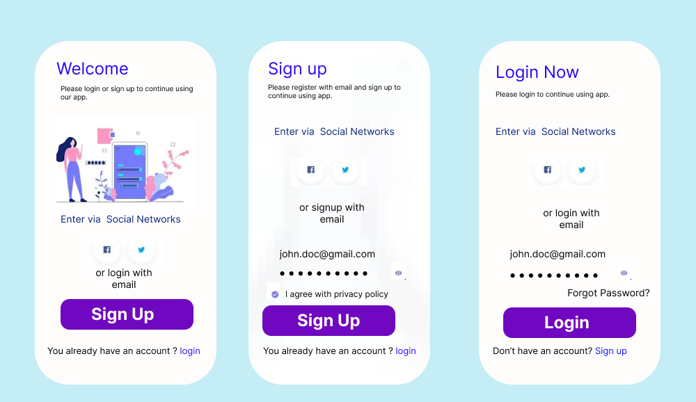
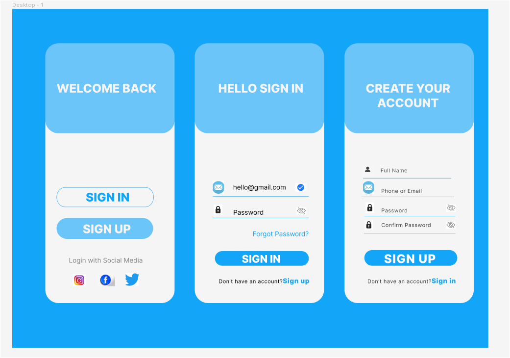
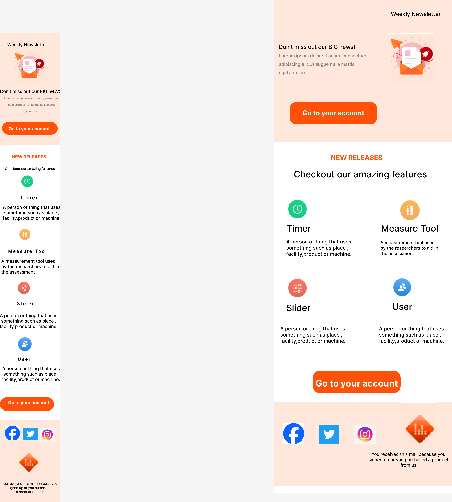
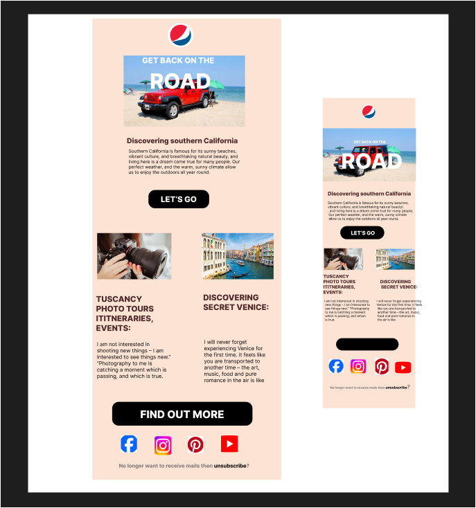

# mobile signup
## task 1
figma link  -> [mobile signup](https://www.figma.com/file/RpgKM6sV40qU094BIb0gMk/Untitled?type=design&mode=design&t=XbK5tzhmZSo46Wvt-0)

### other example
figma link  -> [mobile signup](https://www.figma.com/design/EgM61Jn8GtKGXpPYjI9A6Y/Untitled?node-id=0-1&t=DnL1USZ7JmE2jqcM-0)

# newsletter
## task 2
figma link  -> [newsletter](https://www.figma.com/file/oXG6lTyZXbytpTLkX2Na3x/Untitled?type=design&mode=design&t=XbK5tzhmZSo46Wvt-0)

figma link  -> [newsletter](https://www.figma.com/design/kqDC2nTARWDkv5Wy2OEWWS/Untitled?node-id=0-1&t=AYB4KrNnBsaE1Yfb-0)

# restaurant menu card 
## task 3
figma link  -> [restaurant menu card](https://www.figma.com/file/5uIMTV6ysccb5E23DlrEvd/Untitled?type=design&mode=design&t=XbK5tzhmZSo46Wvt-0)

# ecommerce website 
## task 4
figma link -> [ecommerce website](https://www.figma.com/file/5DiyAeh5FoTyunjOGh8Io0/ecommerce-website?type=design&node-id=0-1&mode=design&t=XbK5tzhmZSo46Wvt-0)

